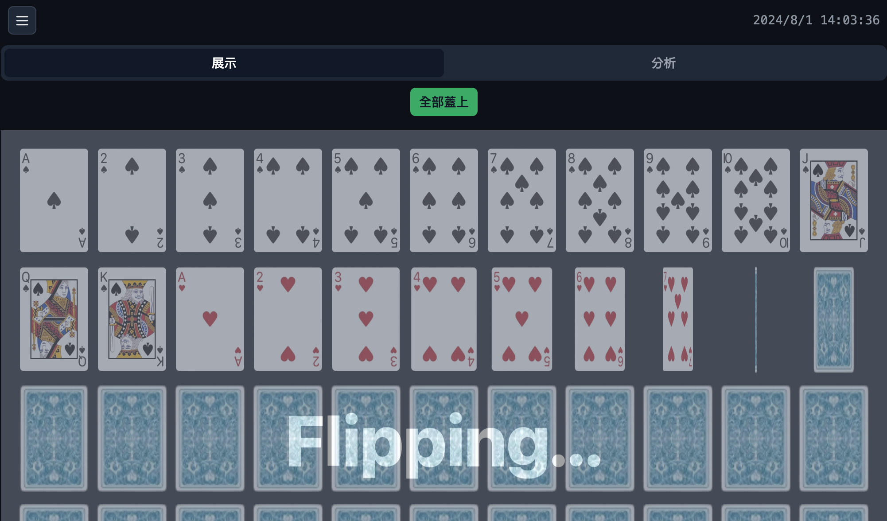
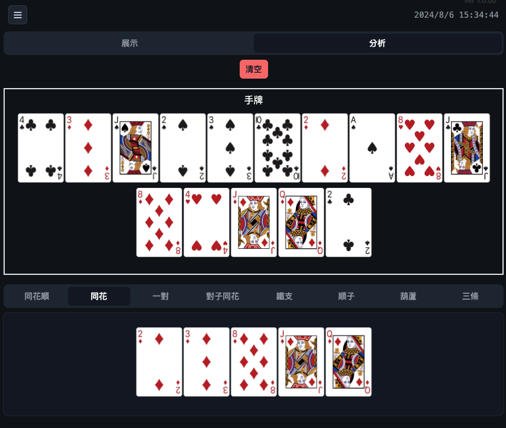
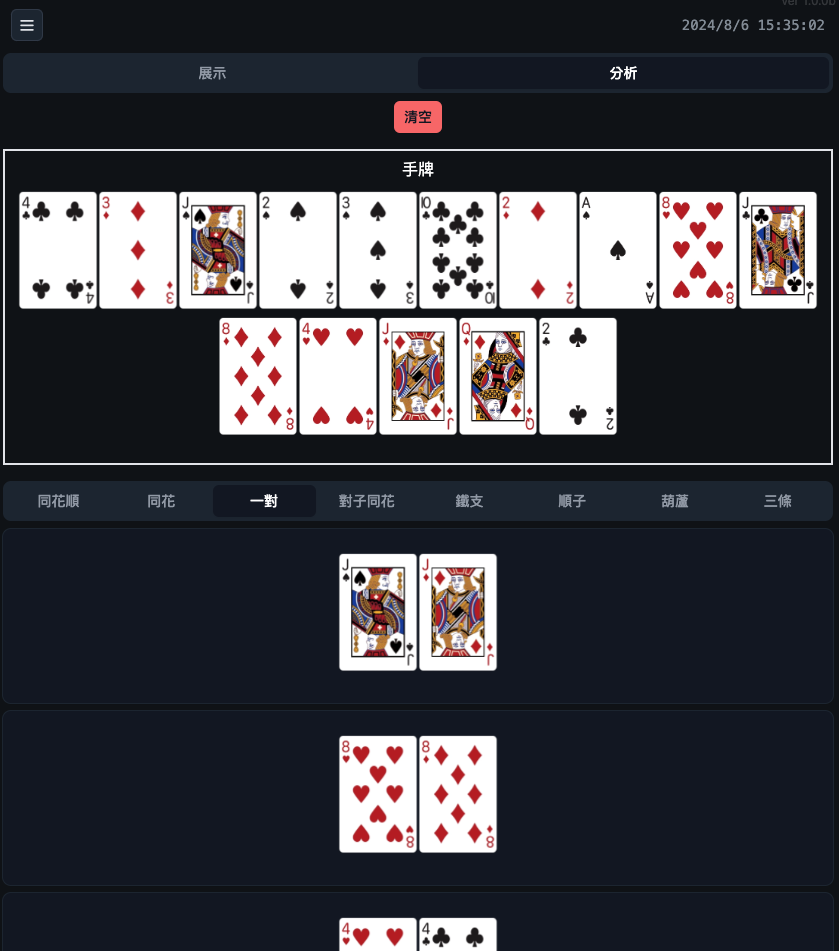

# 專案簡介

本專案旨在展示撲克牌的排列組合與分析結果。主要分為兩個區域：

**展示區：**
呈現一整副撲克牌，可透過按鈕控制所有牌面是否翻開。
翻牌動畫效果流暢，提供視覺上的享受。

**分析區：**
隨機抽取 15 張牌作為手牌。

分析手牌組合，包括同花順、同花、順子、對子同花、鐵支、葫蘆、一對、三條等。
點擊特定組合按鈕，可展示符合該組合的牌型(取最大的 5 組)。

# 技術棧

- 前端框架： Nuxt.js 3
- 狀態管理： Pinia
- UI 框架： Nuxt UI
- 樣式： Tailwind CSS
- 測試： Vitest
- 圖片處理： Nuxt Image
- 路由： Vue Router

# DEMO

[demo](https://crazwade.github.io/PokerComboAnalyzer/)

#### 整付牌展示區

#### 手牌組合分析區

# 開發筆記

- Nuxt UI Image 打包靜態會有路徑失效的問題 [IPX: File not found when using assets directory #1006](https://github.com/nuxt/image/issues/1006)
